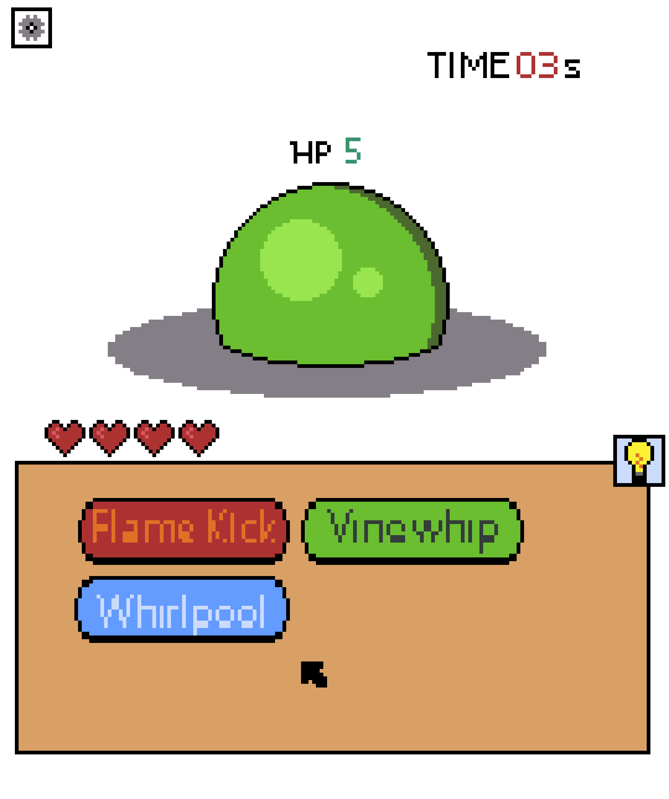
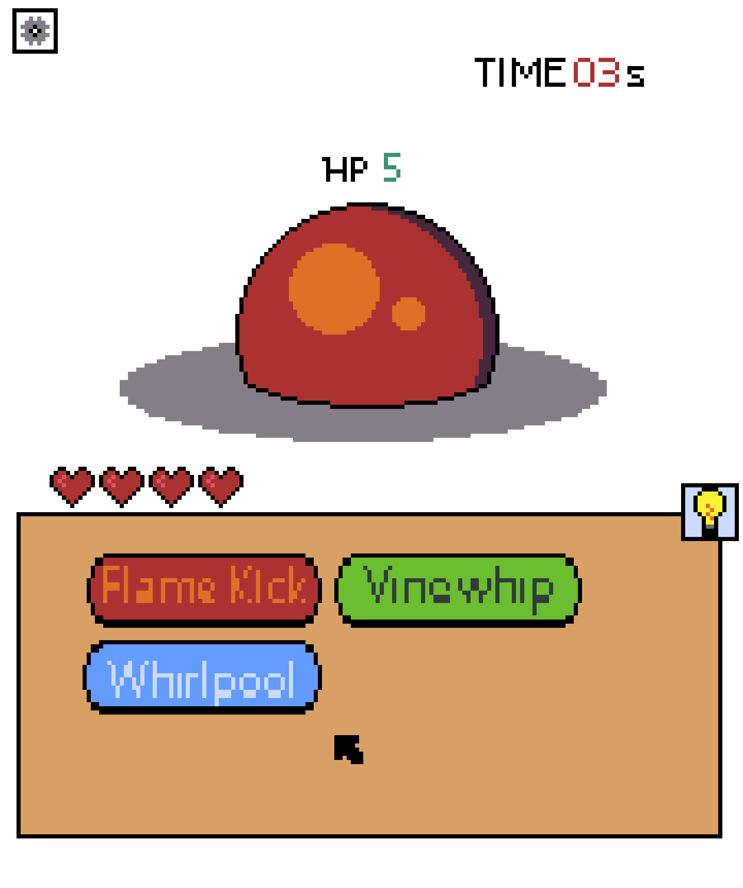
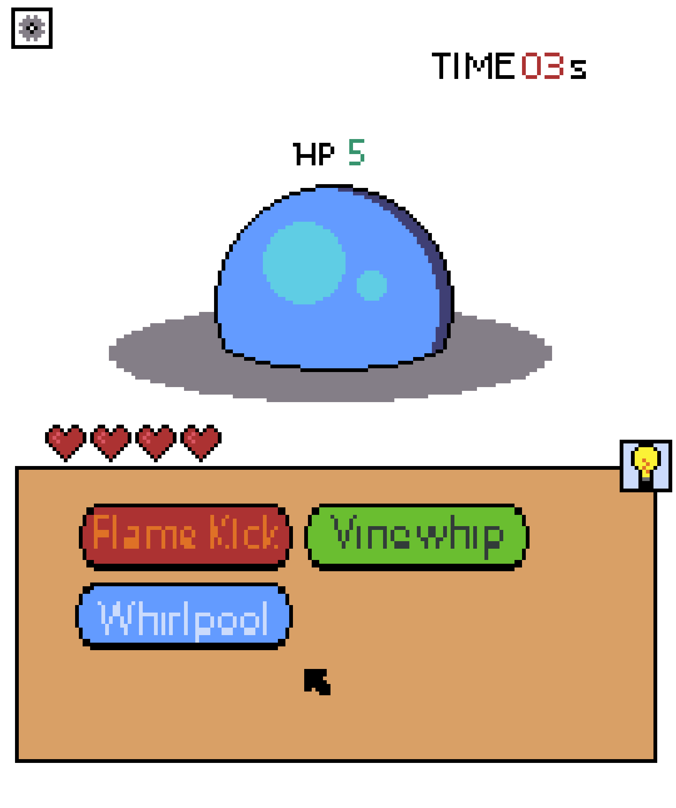

# Slime Slasher
## Background

Slime Slasher is a simple dexterity game where the player must choose the correct attack to defeat the enemy in a limited time. It has the astethic of a turn-based jrpg (Pokemon-like for the uninitiated). Here is an example of the gameplay loop: 
- A  green slime (an enemy) apears on the screen!
- A timer is started
- You click one of three attacks (red, green, or blue)
- If you clicked red you Defeated the Slime! 
  - You recieve Gold (plus a bonus for remaining time on the clock!)
  - A new Slime of a Random Color is loaded in and the timer resets
- If you choose the wrong attack (blue or green) or miss the time, its the slimes turn!
  - Slime will take one of your lives and you will then have another chance to attack.

As the game progresses the timer will get shorter and new Enemy types will appear. The types work in a rock-paper-scissors style (red → green → blue → red ). When your life total reaches 0 the game ends. Your score is equal to the amount of gold you recieved. See how far you can get before being defeated by the slimes!

*This project will use vanilla javascript DOM and canvas*

## Functionality

In Slime Slasher, users will be able to:

* Choose attacks to battle slimes and see animations of attacks
* Collect gold from defeated slimes and see your score displayed against past attempts
* Select difficulty and launch game from Main Menu
* Hear audio feedback of actions displayed on screen

In addition, this project will include:

* Accessablilty features for color-blind players
* Guided tutorial for new players to learn the rules
* Difficulty setting to change the speed of the timer

## Wireframe

 

*Not finalized Assets*

In the **center** of the screen you can see the sprite that will represent the enemy slime. 

Above the slimes head labeled **HP 5** is the remaining health of that slime. This will be animated to show it decrease to 0  when a hit is successful. 

In the top-right corner labeled **TIME** is the countdown timer that shows the remaining time until you loose your chance to attack. 

In the top left corner is a **gear-icon** which will be used to access sound control and accessibility settings as well as letting you exit the game

The **beige box** is your dashboard, This contains all the available moves you can make as buttons.

Above the dashboard are the **hearts** displaying your remaining life.

In the top right corner of the dashboard is the **lightbulb-icon** that will give you information about the current enemy when you see it for the first time.

 

*Above are alternate enemy sprites*

## Implementation Timeline
### Friday 
  - Setup project skeleton
  - Begin creating the basic game objects: Player Object, Enemy Object, and Game Object, Attack object, ect. and test interactions.
  - Connect the game to the html elements
### Weekend
  - Add animations and tweak CSS to get the right feel
  - Add button interaction and animation
  - Begin working on Menus and Home Screen
  - Add sound to game
### Monday
  - Finalize menu interaction and homescreen and add additional animations to give the right feel to menus. 
  - Work on accessability features
### Teusday
  - Add transitional animations to menus
  - Add tips when hovering over something for a specified length of time
### Wednesday
  - Add additional enemy types and tweak the gameplay
### Thursday
  - Add polish where it is needed

 <!-- ### Checklist
 - [ ] Task 1
 - [ ] Task 2
 - [ ] Task 3 -->